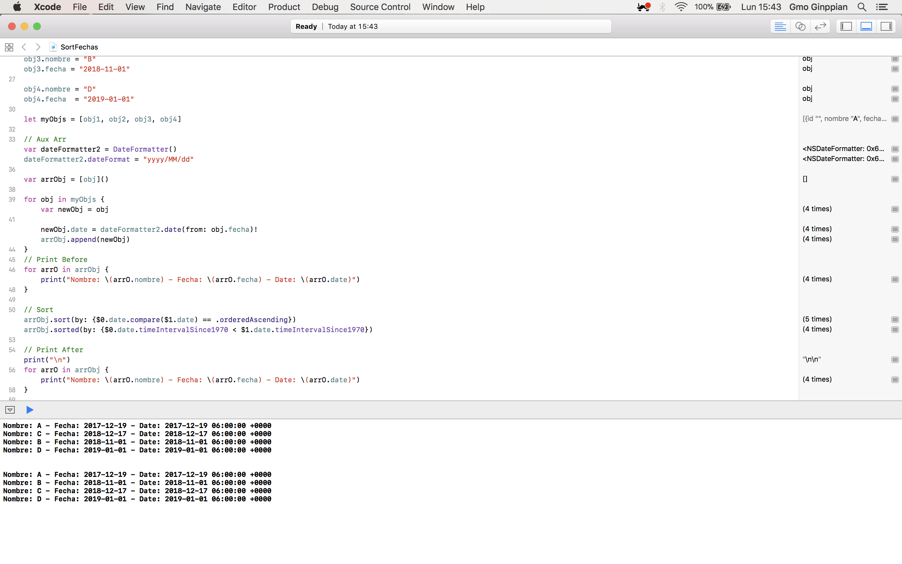

Ordenar un objeto por fecha
====

## Code

We have this array

```swift
// Example

struct obj {
var id = ""
var nombre = ""
var fecha = ""
var date = Date()
}

var obj1 = obj()
var obj2 = obj()
var obj3 = obj()
var obj4 = obj()

obj1.nombre = "A"
obj1.fecha = "2017-12-19"

obj2.nombre = "C"
obj2.fecha = "2018-12-17"

obj3.nombre = "B"
obj3.fecha = "2018-11-01"

obj4.nombre = "D"
obj4.fecha  = "2019-01-01"

let myObjs = [obj1, obj2, obj3, obj4]
```

so we use a auxiliar array

```swift
// Aux Arr
var dateFormatter2 = DateFormatter()
dateFormatter2.dateFormat = "yyyy/MM/dd"

var arrObj = [obj]()

for obj in myObjs {
var newObj = obj

newObj.date = dateFormatter2.date(from: obj.fecha)!
arrObj.append(newObj)
}
// Print Before
for arrO in arrObj {
print("Nombre: \(arrO.nombre) - Fecha: \(arrO.fecha) - Date: \(arrO.date)")
}
```

and sort

```swift
// Sort
arrObj.sort(by: {$0.date.compare($1.date) == .orderedAscending})
arrObj.sorted(by: {$0.date.timeIntervalSince1970 < $1.date.timeIntervalSince1970})

// Print After
print("\n")
for arrO in arrObj {
print("Nombre: \(arrO.nombre) - Fecha: \(arrO.fecha) - Date: \(arrO.date)")
}
```

<p align="center">
    
</p>


